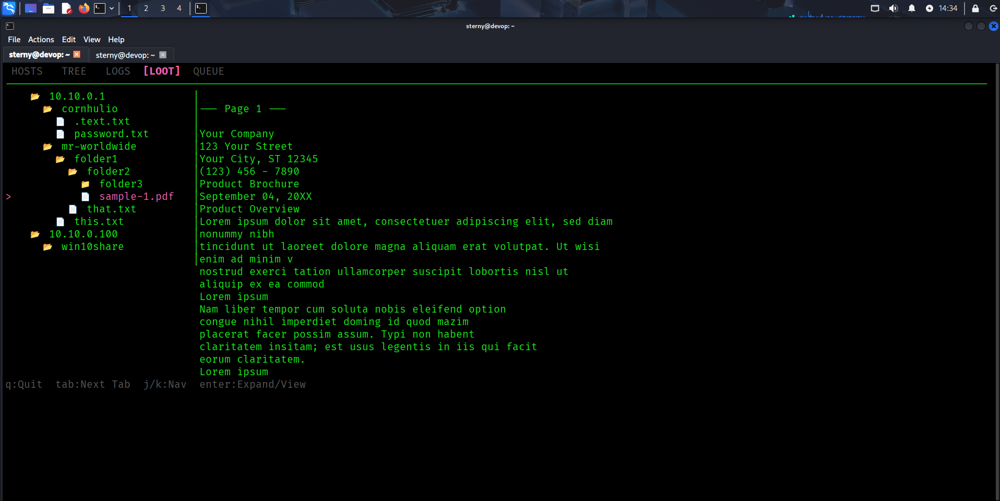
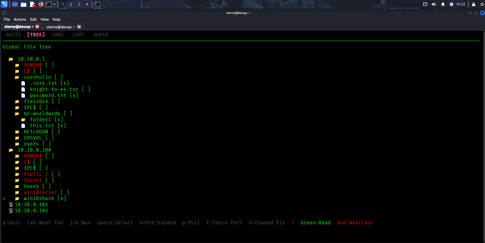
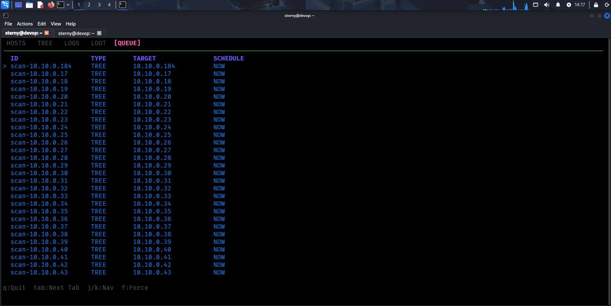

# SMBtree

SMBtree is a high-speed, TUI-based SMB enumeration and exfiltration tool designed for efficiency and ease of use. It handles large-scale network scans, deep directory recursion, and automated data retrieval with a modern, interactive console interface.

## Why Use SMBtree?

-   **Interactive TUI**: Navigate hosts, shares, and files visually with a global tree view.
-   **High Performance**: Multi-threaded scanner with configurable worker pools (default: 50 threads).
-   **Smart Expansion**: Support for CIDR ranges (`10.0.0.0/24`) and iterative depth expansion.
-   **Resilient**: Includes "Jitter" logic to evade detection and robust error handling for connection limits.
-   **OPSEC Safe**: Use `-s` (Safe Shares), `-b` (Blind Mode), and `-a` (Auth Hold) to reduce log noise.
-   **Exfiltration**: Automated recursive downloading and "Loot" management.

## Screenshots

### Loot Management
Easily view, convert, and inspect captured files within the TUI.


### Tree Browser
Navigate shares and directories visually. Expand nodes (`Enter`), select files (`Space`), and queue downloads.


### Job Queue
Monitor active jobs, view status, and prioritize specific tasks (`f`) in real-time.



## Installation

SMBtree is written in Go. To build it from source:

```bash
go build -o smbtree cmd/smbtree/main.go
# Linux Cross-compile
GOOS=linux go build -o smbtree-linux cmd/smbtree/main.go
```

## Usage

### Quick Start (Aggressive)
Scan a CIDR range with full speed (no jitter) and increased threads.
```bash
./smbtree 10.10.0.0/24 -u administrator -p 'Password123' -d devop.local -no-limit -t 50
```

### Low & Slow (Stealth / Exfiltration)
Load targets from a file, spread authentication over time, and configure exfiltration windows.
**Note: All duration flags accept values in MINUTES.**

```bash
# Stealthy Scan (Persistent Session, Blind Mode, Safe Shares, 1 second jitter)
./smbtree hosts.txt -u administrator -p 'Password123' -d devop.local -b -j 1s -s -a

# Aggressive (Old Behavior)
./smbtree hosts.txt -u pwn -p pwn -no-limit -t 50 -auth-hold=false -safe-shares=false
```

### Key Bindings
-   **Arrows / j, k**: Navigate lists.
-   **Tab**: Switch tabs (HOSTS, TREE, LOOT, QUEUE).
-   **Enter**: Expand/Collapse nodes.
-   **D**: Expand/Scan current directory (Depth + 1).
-   **Space**: Select file/folder for batch operations.
-   **p**: Pull (download) selected files.
-   **f**: Force re-scan or force execution.
-   **x**: Generate text report.
-   **Ctrl+C**: Quit.

### Full Usage Manual
```text
Usage: smbtree [flags] <target>
Target: File path, IP/Hostname, or CIDR range.

Authentication Flags:
  -u string
    	Username
  -p string
    	Password
  -d string
    	Domain
  -H string
    	NTLM Hash
  -k	Use Kerberos
  -no-pass
    	Don't ask for password (use empty or guest)
  -a, --auth-hold
        Hold SMB sessions open (persistent connection) (default true)

Delay & Concurrency Flags:
  -auth-duration string
    	Spread SMB auth/tree over time (e.g. 60m)
  -exfil-duration string
    	Spread Exfil/Pull over time (e.g. 120m)
  -j, --file-jitter string
        Jitter/Delay between directory reads (e.g. 100ms)
  -t int
    	Number of concurrent threads (default 10)
  -no-limit
    	Disable all time delays (Go burr)
  -D int
    	Recursion depth for directories (default 2)

Exfiltration Flags:
  -exfil-method string
    	Method: local, http (default local)
  -exfil-url string
    	HTTP URL for exfiltration
  -l, --loot string
    	Local directory for looted files (default 'loot')

OPSEC Flags:
  -s, --safe-shares
        Skip administrative shares (C$, ADMIN$, IPC$) (default true)
  -b, --blind
        Blind Mode: Skip share access checks (reduces log noise)

Mode Flags:
  -headless
    	Run in headless scan mode
  -no-ping
    	Disable ping sweep/live host discovery (treat all targets as live)
```
